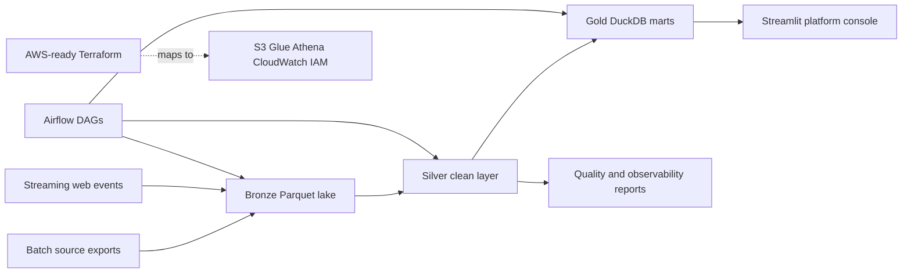
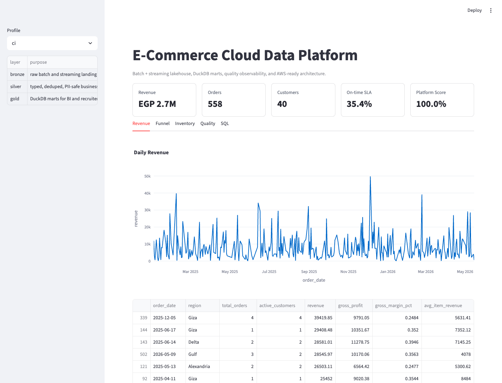

# E-Commerce Cloud Data Platform

[](https://github.com/AhmedYasserShalaby/ecommerce-cloud-data-platform/actions/workflows/tests.yml)
[](https://github.com/AhmedYasserShalaby/ecommerce-cloud-data-platform/actions/workflows/secret-scan.yml)
[](https://github.com/AhmedYasserShalaby/ecommerce-cloud-data-platform/actions/workflows/pages.yml)

Hybrid local/AWS-ready data platform for e-commerce operations: batch ingestion, streaming events, bronze/silver/gold lakehouse layers, Spark-style transformations, dbt/DuckDB marts, Airflow orchestration, quality observability, and a Streamlit platform console.

Technical report: https://ahmedyassershalaby.github.io/ecommerce-cloud-data-platform/

## Project Snapshot

- Processes **250k+ orders and 5M+ event rows** in the full profile.
- Uses **Python, SQL, DuckDB, Parquet, Spark-compatible transforms, dbt models, Airflow, Redpanda, Docker, Terraform, Streamlit, CI**.
- Models revenue, customer LTV, funnel conversion, fulfillment SLA, inventory risk, returns, data quality, freshness, and run history.
- Runs safely on synthetic data with no real customer data or cloud credentials.

## Architecture



## Platform Console Preview



## Local Run

```bash
python3 -m venv .venv
source .venv/bin/activate
pip install -e ".[dev]"
commerce-platform smoke --profile ci
streamlit run app/streamlit_console.py
```

Full scale data generation:

```bash
commerce-platform run-all --profile full
```

Docker:

```bash
docker compose up --build platform
docker compose up dashboard
```

## Documentation

- [Architecture](docs/architecture.md)
- [Data model](docs/data_model.md)
- [Orchestration](docs/orchestration.md)
- [Streaming](docs/streaming.md)
- [AWS mapping](docs/aws_mapping.md)
- [Data quality](docs/data_quality.md)
- [Platform walkthrough](docs/platform_walkthrough.md)

## Sample Outputs

- [Platform scorecard](samples/platform_scorecard.csv)
- [Quality checks](samples/quality_checks.csv)
- [Revenue mart sample](samples/mart_revenue_daily.csv)
- [Data quality report](samples/data_quality_report.md)

## Project Summary

- Built a hybrid local/AWS-ready e-commerce data platform processing 250k+ orders and 5M+ events through batch and streaming ingestion into bronze, silver, and gold lakehouse layers.
- Implemented Spark-compatible cleaning, DuckDB/dbt-style marts, Airflow DAGs, data quality checks, freshness monitoring, and a Streamlit console for revenue, funnel, SLA, inventory, and LTV analytics.
- Added Docker Compose services for MinIO, Redpanda, Airflow, Spark-style jobs, CI validation, secret scanning, and Terraform for S3, Glue, Athena, IAM, and CloudWatch mapping.
