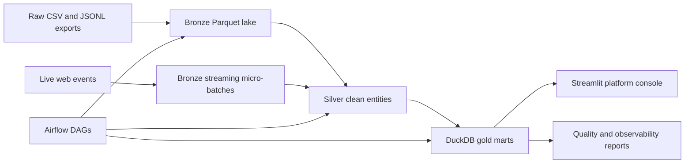

# Architecture

This project is a Docker-first, local/AWS-ready e-commerce data platform.

## Layers

| Layer | Purpose |
| --- | --- |
| Raw | Synthetic source exports with realistic defects. |
| Bronze | Contract-validated Parquet landing zone plus rejected-row evidence. |
| Silver | Typed, deduped, PII-safe business entities. |
| Gold | DuckDB/dbt-style marts for BI and operational analytics. |
| Observability | Contract summary, freshness, quality checks, scorecard, report. |

## Why It Is Useful

- Shows orchestration, quality, lakehouse modeling, streaming, warehouse marts, and dashboarding together.
- Has small CI data and full-scale generation without committing large files.
- Maps cleanly to AWS S3, Glue, Athena, IAM, and CloudWatch.
